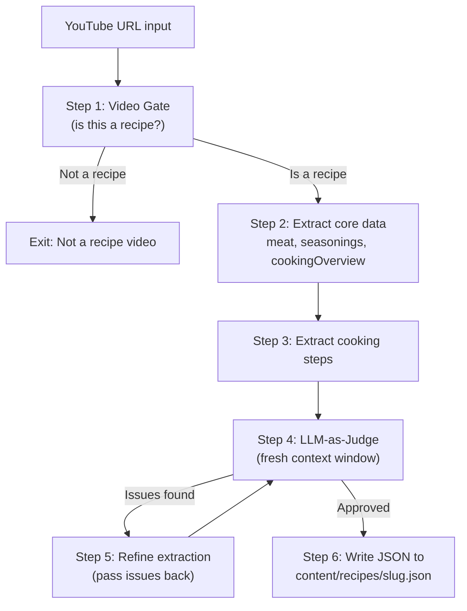

# Recipe Extraction Pipeline with Gemini 3 Flash

## Overview

A standalone TypeScript CLI script (`scripts/extract-recipe.ts`) powered by Gemini 3 Flash that ingests a YouTube video URL, validates it as a BBQ cooking recipe, extracts all recipe attributes via structured outputs, verifies the extraction using a separate LLM-as-judge call, and writes the final JSON to `content/recipes/`.

---

## Architecture



---

## Tech Stack and Dependencies

- **Runtime**: Node.js with `tsx` for direct TypeScript execution
- **LLM SDK**: `@google/genai` (latest) -- Gemini 3 Flash via YouTube URL `fileData`
- **Schema validation**: `zod` + `zod-to-json-schema` for structured outputs
- **API key**: `GEMINI_API_KEY` env var (loaded from `.env` via `dotenv`)

New dependencies to install:

```
npm install @google/genai zod zod-to-json-schema dotenv
npm install -D tsx @types/node
```

Add to `package.json` scripts:

```json
"extract": "tsx scripts/extract-recipe.ts"
```

Usage: `GEMINI_API_KEY=... npm run extract -- "https://www.youtube.com/watch?v=VIDEO_ID"`

---

## File Structure

```
scripts/
  extract-recipe.ts         # Main CLI entry point & orchestrator
  lib/
    gemini.ts               # GoogleGenAI client singleton
    schemas.ts              # All Zod schemas (gate, extraction, judge)
    prompts.ts              # All prompt templates (system + user prompts)
    gate.ts                 # Step 1: Video validation gate
    extract.ts              # Steps 2-3: Core data + steps extraction
    verify.ts               # Step 4-5: LLM-as-judge + refinement loop
    utils.ts                # Slug generation, YouTube ID parsing, etc.
.env                        # GEMINI_API_KEY (gitignored)
```

---

## Step-by-Step Pipeline Design

### Step 1: Video Gate (`gate.ts`)

Quick validation call to determine if the video is a BBQ meat cooking recipe or something else (shop promo, Q&A, tool review, etc.).

- **Input**: YouTube URL via `fileData.fileUri`
- **Model**: `gemini-3-flash-preview` with `thinkingLevel: "low"` (minimize latency)
- **Structured output schema** (Zod):

```typescript
const GateResultSchema = z.object({
  isRecipe: z
    .boolean()
    .describe(
      "True if this video is primarily about cooking/grilling a meat dish",
    ),
  confidence: z.number().min(0).max(1).describe("Confidence score 0-1"),
  reason: z
    .string()
    .describe("Brief explanation of why this is/isn't a recipe"),
  detectedLanguage: z.string().describe("Primary language spoken in the video"),
});
```

- **Prompt**: Concise system instruction asking the model to classify the video. Include examples of what counts (smoking brisket, grilling wings) vs what doesn't (product unboxing, Q&A session, grill assembly).
- **Decision**: Reject if `isRecipe === false` or `confidence < 0.6`. Print reason and exit.

### Steps 2-3: Core Data Extraction (`extract.ts`)

Single call that extracts meat, seasonings, cookingOverview, and steps together (same video context, one pass).

- **Input**: Same YouTube URL via `fileData.fileUri`
- **Model**: `gemini-3-flash-preview` with default thinking (`thinkingLevel: "high"`)
- **Structured output schema** (Zod) -- aligned with existing [app/types/recipe.ts](app/types/recipe.ts):

```typescript
const MeatSchema = z.object({
  type: z
    .string()
    .describe("Normalized lowercase meat type: veis, siga, kana, lammas, kala"),
  cut: z
    .string()
    .describe(
      "Normalized lowercase cut: brisket, ribid, pulled-pork, tiivad, valisfilee",
    ),
  cutDisplay: z.string().describe("Human-readable Estonian name for the cut"),
  weight: z.string().describe("Approximate weight or quantity mentioned"),
  notes: z
    .string()
    .optional()
    .describe("Any special notes about the meat selection"),
});

const SeasoningSchema = z.object({
  name: z.string().describe("Full product name as mentioned/shown in video"),
  type: z.enum(["rub", "sauce", "marinade", "injection", "muu"]),
  brand: z.string().describe("Brand name"),
  amount: z.string().describe("Approximate amount used"),
  shopUrl: z
    .string()
    .describe("URL on bbqassad.ee if recognizable brand, otherwise empty"),
  optional: z.boolean().describe("Whether this seasoning is optional"),
});

const TemperaturePhaseSchema = z.object({
  temperature: z.string().describe("Target temperature, e.g. '110°C'"),
  duration: z
    .string()
    .optional()
    .describe("How long this phase lasts, e.g. '5-6 tundi'"),
  description: z
    .string()
    .describe(
      "What happens at this temperature, e.g. 'Suitsutamine kuni bark tekib'",
    ),
});

const CookingOverviewSchema = z.object({
  totalTime: z.string(),
  prepTime: z.string(),
  cookTime: z.string(),
  restTime: z.string(),
  temperature: z
    .string()
    .describe("Overall temperature range summary, e.g. '110-135°C'"),
  temperaturePhases: z
    .array(TemperaturePhaseSchema)
    .describe(
      "Ordered list of distinct temperature phases during cooking. E.g. start at 110°C for smoking, raise to 135°C after wrapping, finish at 150°C for bark. Include each change mentioned in the video.",
    ),
  difficulty: z.enum(["lihtne", "keskmine", "keeruline"]),
  servings: z.number(),
});

const StepSchema = z.object({
  stepNumber: z.number(),
  title: z.string().describe("Short Estonian title for this step"),
  description: z
    .string()
    .describe("Detailed Estonian description of what happens"),
  temperature: z.string().nullable(),
  duration: z.string(),
  videoTimestamp: z
    .number()
    .describe("Approximate seconds into the video where this step starts"),
  tips: z.array(z.string()).describe("Practical tips mentioned for this step"),
});

const RecipeExtractionSchema = z.object({
  title: z.string().describe("Recipe title in Estonian"),
  description: z.string().describe("2-3 sentence Estonian description"),
  meat: MeatSchema,
  seasonings: z.array(SeasoningSchema),
  equipment: z.array(z.string()),
  cookingOverview: CookingOverviewSchema,
  steps: z
    .array(StepSchema)
    .describe(
      "All cooking steps in order, including prep, cooking, wrapping, resting, sauce making, and serving",
    ),
  tags: z
    .array(z.string())
    .describe("Lowercase tags for search: meat type, cut, technique, brands"),
});
```

- **Prompt strategy**:
  - System instruction explaining this is a BBQ Assad cookbook extraction tool, all text output must be in Estonian, provide one example of the expected format (reference existing recipe JSON)
  - Explicitly instruct: "Include ALL steps: preparation, grill/smoker setup, cooking phases, wrapping (if any), resting, sauce preparation (if any), pulling/slicing, and serving"
  - Explicitly instruct temperature tracking: "Pay close attention to temperature changes throughout the cook. If the cook starts at one temperature and is raised or lowered at any point (e.g., start at 110°C, raise to 125°C after wrapping, bump to 150°C for bark), capture each distinct phase in `cookingOverview.temperaturePhases`. Also record the per-step temperature in each `steps[].temperature` field whenever a specific temperature is mentioned for that step."
  - Include known brands from [content/meta.json](content/meta.json) so the model can match `shopUrl` patterns

### Steps 4-5: LLM-as-Judge Verification Loop (`verify.ts`)

A **fresh context window** (separate API call, no prior conversation history) reviews the extracted data against the video.

- **Input**: YouTube URL via `fileData.fileUri` + the extracted JSON (serialized as text)
- **Model**: `gemini-3-flash-preview` with `thinkingLevel: "high"`
- **Structured output schema**:

```typescript
const JudgeResultSchema = z.object({
  approved: z
    .boolean()
    .describe("True if extraction accurately represents the video"),
  overallScore: z.number().min(1).max(10).describe("Quality score 1-10"),
  issues: z.array(
    z.object({
      field: z
        .string()
        .describe(
          "JSON path of the problematic field, e.g. 'meat.type' or 'steps[2].description'",
        ),
      severity: z.enum(["critical", "minor"]),
      description: z.string().describe("What is wrong"),
      suggestion: z.string().describe("What the correct value should be"),
    }),
  ),
});
```

- **Prompt**: "You are a quality assurance reviewer. Watch the video and compare the extracted recipe data below. Check for: (1) factual accuracy of meat type/cut, (2) all seasonings correctly identified with correct brands, (3) cooking temperatures and times match the video -- including all temperature transitions/phases (starting temp, any mid-cook raises or drops, finishing temp), (4) no missing steps, (5) step ordering is correct, (6) video timestamps are roughly accurate, (7) temperaturePhases in cookingOverview captures every distinct temperature change mentioned in the video. Return your verdict."
- **Refinement loop**:
  - If `approved === false` and there are `critical` issues: feed the issues back to the extraction step as additional context ("Previous extraction had these issues: ..."), re-extract, then re-verify
  - Maximum 2 refinement iterations to avoid infinite loops
  - If still not approved after 2 retries: write the best result with a warning to stderr

### Step 6: Assemble and Write JSON

After verification passes, the orchestrator in `extract-recipe.ts`:

1. **Update TypeScript types**: Add a `TemperaturePhase` interface and a `temperaturePhases` field to the `CookingOverview` interface in [app/types/recipe.ts](app/types/recipe.ts), so the website can render temperature transitions on the recipe detail page:

```typescript
export interface TemperaturePhase {
  temperature: string;
  duration?: string;
  description: string;
}

export interface CookingOverview {
  // ... existing fields ...
  temperaturePhases?: TemperaturePhase[]; // optional so existing recipes stay valid
}
```

1. Parses the YouTube URL to extract `youtubeId`
2. Generates `slug` from the title (Estonian-safe slugification: lowercase, replace spaces/special chars with hyphens)
3. Generates `id` (same as slug)
4. Constructs the `video` object: `youtubeId`, `url`, `title` (from extraction), `thumbnailUrl` (template: `https://img.youtube.com/vi/{id}/maxresdefault.jpg`), `duration` and `publishedAt` left as empty strings (can be enriched later via YouTube Data API)
5. Assembles the full `Recipe` object matching the interface in [app/types/recipe.ts](app/types/recipe.ts)
6. Sets `thumbnailUrl` for each step to a placeholder pattern: `/images/recipes/{slug}/step-{n}.jpg`
7. Sets `relatedRecipes` to `[]` (populated manually or in a future step)
8. Sets `createdAt` and `updatedAt` to today's ISO date
9. Writes pretty-printed JSON to `content/recipes/{slug}.json`
10. Prints success message with the file path

---

## Prompt Engineering Details

All prompts stored in `scripts/lib/prompts.ts` as template functions. Key considerations:

- **Language**: System instructions specify Estonian output. Include a few Estonian cooking terms as examples to anchor the model.
- **Brand matching**: Include the known brand list from `meta.json` (`Blues Hog`, `Meat Church`, `Kosmo's Q`, `Heath Riles`, `Cooklounge`) so the model can generate correct `shopUrl` patterns like `https://bbqassad.ee/toode/{slug}/`.
- **Step completeness**: Explicitly enumerate step types to extract: "ettevalmistus (prep), grilli/ahi ettevalmistus (grill setup), maitsestamine (seasoning), suitsutamine/grillimine (cooking), mähkimine (wrapping), puhkamine (resting), kastme valmistamine (sauce prep), lõikamine/rebimine (slicing/pulling), serveerimine (serving)".
- **Video context**: Place the `fileData` part first, then the text prompt (as recommended by Gemini docs).

---

## Error Handling

- **API errors**: Catch and retry with exponential backoff (1 retry)
- **Schema validation failures**: If Gemini returns JSON that doesn't match the Zod schema, log the raw response and retry once
- **Missing API key**: Fail fast with clear error message
- **Invalid YouTube URL**: Validate URL format before making any API calls

---

## Configuration Constants

In `scripts/lib/gemini.ts`:

```typescript
export const MODEL = "gemini-3-flash-preview";
export const MAX_JUDGE_RETRIES = 2;
```
